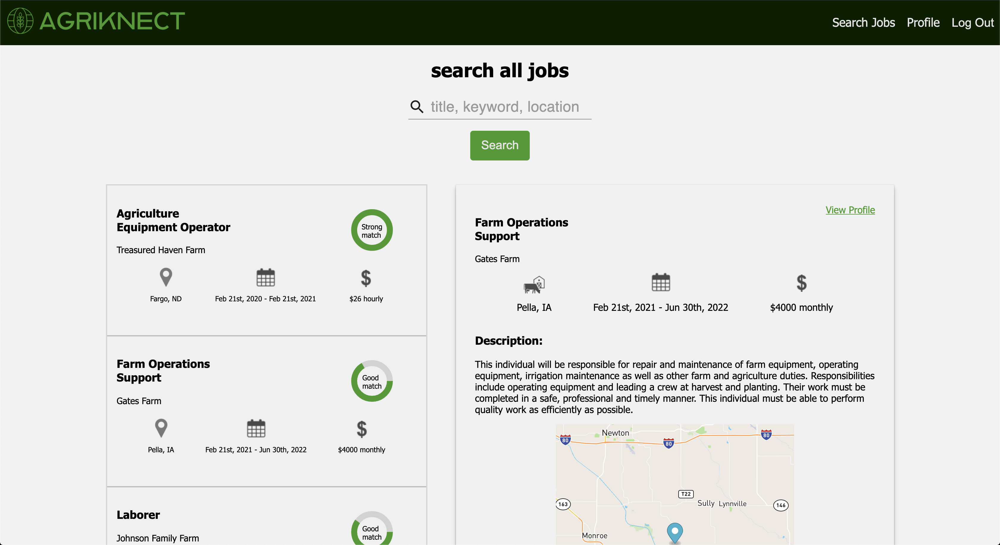

# AgriKnect

## Description

Duration: 2 week sprint

AgriKnect is a job platform built to connect farmers and agriculture workers based on skills matching. It allows each of the two types of users (employers and workers) to create a personal account and profile that is specific to their type. From there, employers are easily able to create detailed job postings that specify certain skills that they require. Workers are able to search available jobs by title, keyword or location and the application will provide a detailed list of related jobs. These jobs are then organized by how well the workers skills match the job requirements. 

To use this app, click the get started button on the home page. You will be prompted to choose a user type (employer or worker) and then be guided through a form to complete your profile. After the profile is complete, employers will have the ability to post jobs and workers will have the ability to search for jobs. Both functions are available as buttons in the nav bar at the top.

To see the fully functional site, please visit: LINK GOES HERE

## Screen Shots

## Prerequisites

Before you get started, make sure you have the following software installed on your computer:

- [Node.js](https://nodejs.org/en/)
- [PostrgeSQL](https://www.postgresql.org/)
- [Nodemon](https://nodemon.io/)

## Installation

- Create a new database called `agriknect` and create tables with the SQL create table statements provided in the database.sql file. Also, insert the proficiencies table data that is provided. The project is built on Postgres, so you will need to make sure to have that installed. We recommend using Postico to run those queries as that was used to create the queries.

- Open up your editor of choice and run an npm install.

- Run npm run server in your terminal.

- Run npm run client in your terminal. The npm run client command will open up a new browser tab for you.

- Create a `.env` file at the root of the project and paste this line into the file:        `SERVER_SESSION_SECRET=secret`. Replace `secret` with some long random string like `25POUbVtx6RKVNWszd9ERB9Bb6` to keep the application secure.

- For map functionality, you will need an API key from (https://mapbox.com/). Set this key as a variable in the `.env` file as `REACT_APP_MAPBOX_API_KEY`

## Built With

- JavaScript
- React
- Redux.js
- Redux Saga
- Express.js
- Node.js
- SQL
- PostgreSQL
- Material UI
- Mapbox API

## Acknowledgement

Thanks to Prime Digital Academy and Nick Hofer (founder of AgriKnect) who equipped and helped our team make this application a reality.

